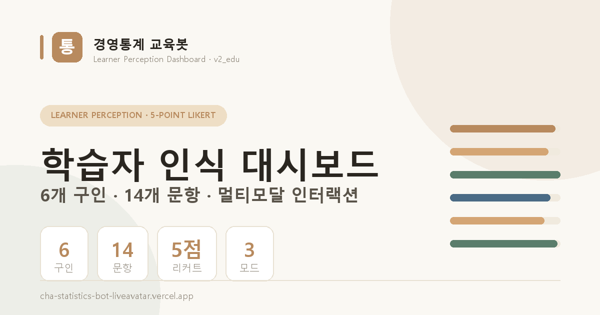

# 경영통계 교육봇 · 학습자 인식 대시보드 안내

AI 챗봇 기반 **경영통계 교육봇**의 학습자 인식 설문·사용 통계 대시보드를 정리한 정적 안내 페이지입니다.

## 📄 내용

- **학습자 인식 측정 도구** — 6개 구인 · 14개 문항 · 5점 리커트 척도
- **3가지 인터랙션 모드** — FTF(아바타) · STS(음성) · TTT(텍스트)
- **분석 항목** — 구인·문항별 평균, 모드 사용 분포, 사전수준별 효과, 인구통계, 자유응답, 사용 통계
- **시스템 구성** — 클라이언트(Vercel) / API(aiforalab.com) / 스키마(cha_statistics_db)

## 🔗 링크

- **라이브 대시보드:** https://cha-statistics-bot-liveavatar.vercel.app/dashboard/ (토큰 필요)
- **이 안내 페이지:** GitHub Pages로 배포

## 🗂 구성

| 파일 | 설명 |
|------|------|
| `index.html` | 대시보드 안내 페이지 (단일 파일) |
| `thumbnail.png` | OG/소셜 썸네일 (1200×630) |
| `favicon.svg` | 파비콘 |
| `make_thumb.py` | 썸네일 생성 스크립트 (Pillow) |

> 본 페이지는 라이브 대시보드의 측정 체계와 설문 구조를 정리한 정적 문서입니다. 실시간 집계 수치는 대시보드 토큰이 필요합니다.
